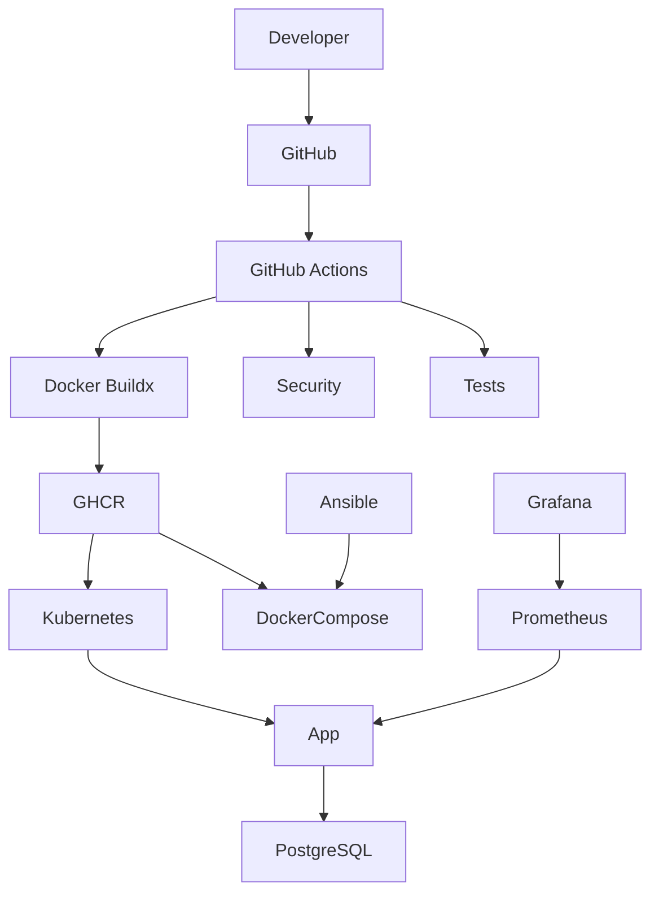

# Production-Ready DevOps Project

[](https://github.com/slambek/production-ready-devops-project/actions/workflows/ci.yml)

A production-ready DevOps practice project built around a FastAPI application. The repository demonstrates containerization, CI/CD, infrastructure automation, Kubernetes deployment, monitoring, and security best practices.

## Architecture



## Tech Stack

- Python / FastAPI
- PostgreSQL
- Docker & Docker Compose
- GitHub Actions
- GitHub Container Registry (GHCR)
- Kubernetes (Kustomize)
- Helm
- Ansible + Ansible Vault
- Prometheus & Grafana
- Trivy
- Nginx

## Project Structure

```text
app/            FastAPI application
ansible/        Server provisioning
deploy/         Production deployment
docker/nginx/   Nginx configuration
helm/           Helm chart
k8s/            Kubernetes manifests
monitoring/     Prometheus & Grafana
tests/          Application tests
```

## Local Development

```bash
cp .env.example .env
docker compose up --build -d

curl http://127.0.0.1:8080/health
curl http://127.0.0.1:8080/ready
```

Run all checks:

```bash
make check
```

## CI/CD

Every push runs:

- Ruff
- Pytest
- Helm validation
- Kubernetes manifest validation
- Trivy security scan
- Multi-platform Docker build
- Publish image to GHCR

Supported platforms:

```text
linux/amd64
linux/arm64
```

## Production Deployment

```bash
cp deploy/.env.example deploy/.env
./deploy/deploy.sh
```

Deployment automatically:

- pulls images from GHCR
- starts PostgreSQL
- deploys the application
- starts Prometheus & Grafana
- verifies application health

## Ansible

Provision a server:

```bash
ansible-playbook \
  -i ansible/inventory/hosts.ini \
  ansible/playbook.yml \
  --ask-vault-pass
```

## Kubernetes

Deploy:

```bash
kubectl apply -k k8s/base
```

Resources include:

- Deployment
- Service
- Ingress
- ConfigMap & Secret
- PersistentVolumeClaim
- HPA
- PodDisruptionBudget
- NetworkPolicy

## Helm

```bash
helm upgrade --install devops \
  helm/production-ready-devops-project \
  --namespace devops-helm \
  --create-namespace
```

## Monitoring

- Prometheus metrics
- Grafana dashboards
- Readiness & liveness probes

## Security

- Non-root containers
- Read-only root filesystem
- Dropped Linux capabilities
- RuntimeDefault seccomp
- Ansible Vault
- Trivy scanning
- NetworkPolicy

Run:

```bash
make security
```

## Useful Commands

```bash
make check
make security
make helm-lint
make kubeconform
make deploy-prod
```

## Author

**Alimkhan Slambek**

GitHub: https://github.com/slambek
