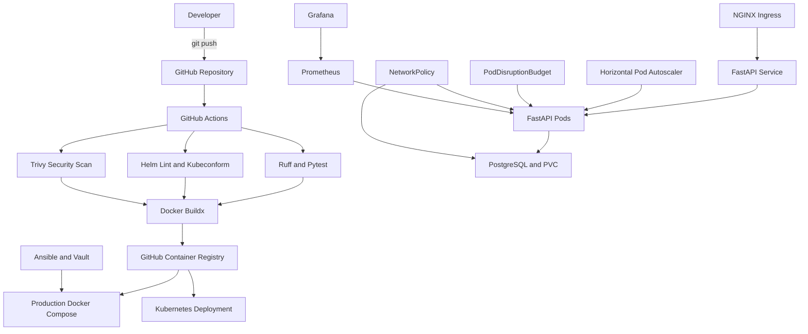

# Production-Ready DevOps Project

[](https://github.com/slambek/production-ready-devops-project/actions/workflows/ci.yml)
[](https://github.com/slambek/production-ready-devops-project/pkgs/container/production-ready-devops-project)
[](#kubernetes)
[](#helm)
[](#security)

A production-oriented DevOps portfolio project demonstrating the complete delivery lifecycle of a containerized FastAPI application: development, testing, containerization, CI/CD, deployment, configuration management, monitoring, Kubernetes orchestration, Helm packaging, autoscaling, and security scanning.

## Overview

The project contains a small FastAPI service backed by PostgreSQL and focuses on the infrastructure and delivery processes surrounding the application.

The repository demonstrates:

* containerized application delivery;
* automated testing and code-quality checks;
* multi-architecture Docker image publishing;
* production deployment with Docker Compose;
* server provisioning with Ansible;
* encrypted secrets with Ansible Vault;
* Kubernetes deployment with Kustomize;
* reusable packaging with Helm;
* monitoring with Prometheus and Grafana;
* autoscaling and availability controls;
* Kubernetes network isolation;
* vulnerability, secret, and misconfiguration scanning.

## Architecture



## Technology Stack

| Area                     | Technologies                       |
| ------------------------ | ---------------------------------- |
| Application              | Python 3.11, FastAPI, Uvicorn      |
| Database                 | PostgreSQL 17                      |
| Testing                  | Pytest                             |
| Code quality             | Ruff, pre-commit                   |
| Containers               | Docker, Docker Compose, Buildx     |
| Reverse proxy            | Nginx                              |
| CI/CD                    | GitHub Actions                     |
| Container registry       | GitHub Container Registry          |
| Configuration management | Ansible, Ansible Vault             |
| Orchestration            | Kubernetes, Minikube               |
| Packaging                | Helm, Kustomize                    |
| Monitoring               | Prometheus, Grafana                |
| Validation               | kubeconform                        |
| Security                 | Trivy, Kubernetes Security Context |
| Supported architectures  | linux/amd64, linux/arm64           |

## Repository Structure

```text
.
├── .github/workflows/       # CI/CD workflows
├── ansible/                 # Server provisioning and encrypted variables
├── app/                     # FastAPI application
├── deploy/                  # Production Docker Compose deployment
├── docker/nginx/            # Nginx configuration
├── helm/                    # Reusable Helm chart
├── k8s/base/                # Kubernetes and Kustomize manifests
├── monitoring/              # Prometheus and Grafana configuration
├── tests/                   # Application tests
├── Dockerfile
├── docker-compose.yml
├── Makefile
├── pyproject.toml
└── requirements-dev.txt
```

## Application Endpoints

| Endpoint   | Purpose                        |
| ---------- | ------------------------------ |
| `/`        | Service information            |
| `/health`  | Liveness check                 |
| `/ready`   | Database-aware readiness check |
| `/metrics` | Prometheus metrics             |
| `/docs`    | OpenAPI documentation          |

Example response:

```json
{
  "status": "ready",
  "database": "available"
}
```

## Local Development

### Requirements

* Python 3.11+
* Docker Desktop
* Docker Compose
* Make

### Environment

Create a local environment file:

```bash
cp .env.example .env
```

Update the passwords inside `.env`.

### Start the stack

```bash
docker compose up --build -d
```

Check container status:

```bash
docker compose ps
```

Test the application:

```bash
curl http://127.0.0.1:8080/health
curl http://127.0.0.1:8080/ready
```

Stop the stack:

```bash
docker compose down
```

## Development Checks

Run all Python checks:

```bash
make check
```

The command runs:

```text
Ruff lint
Ruff formatting validation
Pytest
Pre-commit hooks
```

Individual commands:

```bash
python -m ruff check .
python -m ruff format --check .
python -m pytest -v
pre-commit run --all-files
```

## Production Docker Deployment

The production deployment uses the image published in GitHub Container Registry instead of building the application directly on the server.

Create the production environment:

```bash
cp deploy/.env.example deploy/.env
```

Run deployment:

```bash
./deploy/deploy.sh
```

Or:

```bash
make deploy-prod
```

The deployment script:

1. pulls the latest container images;
2. starts PostgreSQL;
3. waits for database readiness;
4. starts FastAPI and Nginx;
5. starts Prometheus and Grafana;
6. checks the application health endpoint;
7. prints logs if the health check fails.

Production image:

```text
ghcr.io/slambek/production-ready-devops-project:latest
```

## CI/CD Pipeline

The GitHub Actions pipeline runs on pushes and pull requests.

```text
Git push
   │
   ├── Python lint and tests
   ├── Helm lint and template rendering
   ├── Kubernetes schema validation
   └── Trivy security scanning
           │
           ▼
    Multi-architecture Docker build
           │
           ▼
    GitHub Container Registry
```

The Docker image is built for:

```text
linux/amd64
linux/arm64
```

Published tags include:

```text
latest
sha-<commit-sha>
```

## Monitoring

The local and production Docker Compose stacks include Prometheus and Grafana.

### Prometheus

```text
http://127.0.0.1:9090
```

Prometheus collects:

* total HTTP requests;
* request rate;
* response duration;
* HTTP status codes;
* FastAPI target availability.

### Grafana

```text
http://127.0.0.1:3000
```

The datasource and dashboard are provisioned automatically from files stored in the repository.

The dashboard includes:

* total HTTP requests;
* requests per second;
* 5xx error percentage;
* FastAPI availability;
* requests grouped by endpoint;
* P95 latency;
* responses grouped by status;
* average response duration.

## Ansible

Ansible prepares an Ubuntu host for deployment.

The playbook performs:

* base package installation;
* deployment user creation;
* Docker repository configuration;
* Docker Engine installation;
* Docker Compose installation;
* deployment directory creation;
* production configuration copying;
* monitoring configuration copying;
* encrypted environment generation.

Check syntax:

```bash
ansible-playbook \
  -i ansible/inventory/hosts.ini.example \
  ansible/playbook.yml \
  --syntax-check
```

Run the playbook:

```bash
ansible-playbook \
  -i ansible/inventory/hosts.ini \
  ansible/playbook.yml \
  --ask-vault-pass
```

Sensitive variables are encrypted using Ansible Vault.

## Kubernetes

The Kubernetes manifests are located in:

```text
k8s/base/
```

Included resources:

* Namespace;
* ConfigMap;
* Secret generator;
* PostgreSQL Deployment;
* PersistentVolumeClaim;
* PostgreSQL Service;
* FastAPI Deployment;
* FastAPI Service;
* Ingress;
* HorizontalPodAutoscaler;
* PodDisruptionBudget;
* NetworkPolicy.

Apply with Kustomize:

```bash
kubectl apply -k k8s/base
```

Check rollout:

```bash
kubectl rollout status deployment/postgres --timeout=180s
kubectl rollout status deployment/app --timeout=180s
```

Check resources:

```bash
kubectl get pods
kubectl get deployments
kubectl get services
kubectl get ingress
kubectl get hpa
kubectl get pdb
kubectl get networkpolicy
```

Test readiness inside the cluster:

```bash
kubectl run curl-client \
  --rm \
  --restart=Never \
  -it \
  --image=curlimages/curl \
  -- curl -s http://app:8000/ready
```

## Kubernetes Availability and Scaling

The application Deployment runs at least two replicas.

The Horizontal Pod Autoscaler is configured with:

```text
Minimum replicas: 2
Maximum replicas: 6
Target CPU: 50%
```

The PodDisruptionBudget keeps at least one application replica available during voluntary disruptions.

The rolling update strategy uses:

```yaml
maxUnavailable: 0
maxSurge: 1
```

This allows Kubernetes to start a healthy replacement Pod before terminating an existing replica.

## Kubernetes Network Security

NetworkPolicy limits traffic between components.

```text
Ingress Controller → FastAPI :8000
FastAPI            → PostgreSQL :5432
Other workloads    ✕ PostgreSQL
```

The effectiveness of NetworkPolicy depends on a compatible Kubernetes CNI plugin.

## Helm

The reusable Helm chart is located in:

```text
helm/production-ready-devops-project/
```

Create local values:

```bash
cp \
  helm/production-ready-devops-project/values.yaml \
  helm/production-ready-devops-project/values.local.yaml
```

Set a local PostgreSQL password and a unique Ingress hostname.

Validate the chart:

```bash
make helm-lint
make helm-template
make kubeconform
```

Install or upgrade:

```bash
helm upgrade --install devops \
  helm/production-ready-devops-project \
  --namespace devops-helm \
  --create-namespace \
  -f helm/production-ready-devops-project/values.local.yaml
```

Check history:

```bash
helm history devops -n devops-helm
```

Rollback:

```bash
helm rollback devops <revision> -n devops-helm
```

## Security

The workloads use Kubernetes security hardening:

* fixed numeric non-root UID and GID;
* `runAsNonRoot: true`;
* `allowPrivilegeEscalation: false`;
* read-only root filesystems;
* all Linux capabilities dropped;
* `RuntimeDefault` seccomp profile;
* dedicated writable temporary volumes;
* restricted network access;
* encrypted deployment secrets.

Run the security scan:

```bash
make security
```

Trivy scans:

* Python dependencies;
* container configuration;
* Kubernetes manifests;
* Helm templates;
* Infrastructure-as-Code misconfigurations;
* committed secrets.

Current result:

```text
Vulnerabilities: 0
Secrets: 0
High/Critical misconfigurations: 0
```

## Useful Make Commands

```bash
make check
make security
make helm-lint
make helm-template
make kubeconform
make deploy-prod
make down-prod
make logs-prod
```

## Key Engineering Decisions

### Health and readiness are separated

`/health` confirms that the process is alive.

`/ready` confirms that the application can connect to PostgreSQL and is ready to receive traffic.

### Images use fixed non-root users

The runtime image uses numeric UID and GID `1000`, allowing Kubernetes to verify that the process cannot run as root.

### Production uses immutable artifacts

Production Compose and Kubernetes pull an image from GHCR rather than building application code on the target host.

### Secrets are not committed as plaintext

Local `.env`, Kubernetes secret source files, Helm local values, and inventories are excluded from Git. Ansible deployment secrets are encrypted with Vault.

### Deployment configuration is declarative

Docker Compose, Ansible, Kustomize, Kubernetes manifests, Helm templates, monitoring configuration, and CI workflows are stored in version control.

## Project Status

The project currently demonstrates a complete local production-style delivery path:

```text
Code
→ Tests
→ Security scanning
→ Docker build
→ Multi-architecture image
→ Container registry
→ Docker Compose or Kubernetes
→ Health checks
→ Autoscaling
→ Monitoring
```

## Author

**Alimkhan Slambek**

Software Engineer focused on DevOps, cloud infrastructure, automation, containers, CI/CD, and Kubernetes.

* GitHub: [slambek](https://github.com/slambek)
