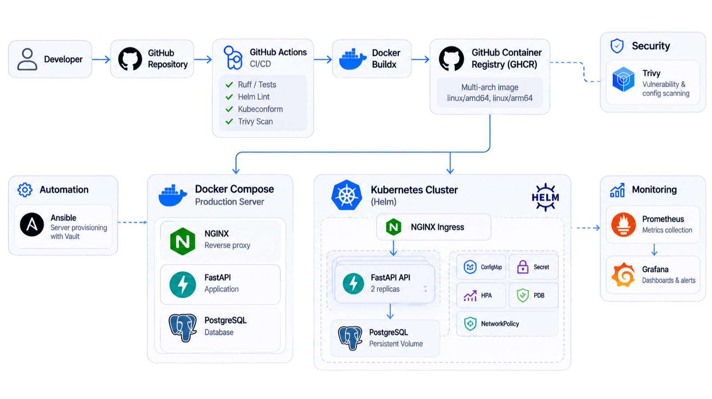

<p align="center">
  
</p>

FastAPI + PostgreSQL project with Docker, GitHub Actions, Kubernetes, Helm and Ansible.

## Run locally

```bash
cp .env.example .env
docker compose up --build -d
```

Check:

```bash
curl http://127.0.0.1:8080/health
curl http://127.0.0.1:8080/ready
```

## Tests / checks

```bash
make check
make security
```

## Production

```bash
cp deploy/.env.example deploy/.env
./deploy/deploy.sh
```

The deploy script pulls the image from GHCR, starts PostgreSQL, the app, Prometheus and Grafana.

## Kubernetes

```bash
kubectl apply -k k8s/base
```

or with Helm:

```bash
helm upgrade --install devops \
  helm/production-ready-devops-project \
  --namespace devops-helm \
  --create-namespace
```

## Ansible

```bash
ansible-playbook \
  -i ansible/inventory/hosts.ini \
  ansible/playbook.yml \
  --ask-vault-pass
```

## What's inside

```text
app/            FastAPI
ansible/        server setup
deploy/         production deploy
docker/nginx/   nginx
helm/           Helm chart
k8s/            Kubernetes
monitoring/     Prometheus + Grafana
tests/          tests
```

CI builds `linux/amd64` and `linux/arm64` images and pushes them to GHCR.
